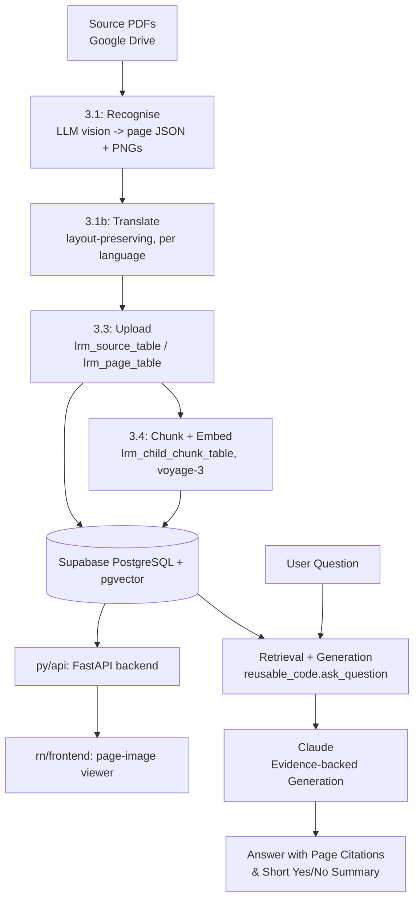

# LRM11 — Language Reading Model: page-image book viewer + retrieval

A pipeline that takes scanned/PDF books, recognises every page (text + word-level bounding boxes) via an
LLM vision call, translates each page into every other supported language with the layout preserved, serves
the result through a page-image viewer app, and (on top of that) chunks + embeds the recognised text so it
can be asked questions about — grounded, cited-by-page answers, the same retrieval techniques a RAG pipeline
uses (hybrid search, reranking, HyDE, multi-query, page expansion), built once in
[`py/reusable_code/`](py/reusable_code/).

## Architecture Overview



Everything lives under `py/` (Python backend) and `rn/` (the React Native/Expo frontend); `sql/` holds the
schema at the repo root, shared reference point for both.

## Step 1: Environment & Dependencies Setup

### 1.1 Clone & Enter Workspace
```bash
git clone https://github.com/fotomain/RAG11-nutriciology.git
cd RAG11-nutriciology
```

### 1.2 Create & Activate Python Virtual Environment
Python 3.10+ is recommended. The venv, `requirements.txt`, and all Python code live under `py/`:
```bash
python3 -m venv py/.venv
source py/.venv/bin/activate
```

### 1.3 Install Python Dependencies
```bash
pip install --upgrade pip
pip install -r py/requirements.txt
pip install -e py/   # makes `reusable_code` importable from any notebook/script under py/
```

### 1.4 Frontend
```bash
cd rn/frontend && npm install
```

---

## Step 2: Prepare API Keys & Secrets (`.env`)

```bash
cp py/.env.sample py/.env
```

Fill in `PUBLIC_SUPABASE_URL`, `SUPABASE_SERVICE_ROLE_KEY`/`PUBLIC_SUPABASE_ANON_KEY`, `VOYAGE_API_KEY`,
`ANTHROPIC_API_KEY`, `LRM_SOURCES_FOLDER` (a Google Drive folder of source PDFs), and `OCR_PROVIDER_NAME`
(`ocr_with_google` — default, needs `GOOGLE_AI_API_KEY` — or `ocr_with_aws`, needs AWS Bedrock credentials).

> [!IMPORTANT]
> Never commit your `.env` file to version control. It is protected and excluded by `.gitignore`.

---

## Step 3: Initialize the Database in Supabase

Paste [`sql/create_lrm_tables.sql`](sql/create_lrm_tables.sql) into the Supabase SQL Editor and run it.
First time only — the upload/chunk scripts talk to Supabase over its REST API (`PUBLIC_SUPABASE_URL` +
`SUPABASE_SERVICE_ROLE_KEY`), which can't run schema DDL itself, so this one step stays manual. It creates:

- `lrm_language_table` — reference table of supported language codes (fr/en/ru seeded; add more by inserting a row)
- `lrm_source_table` — one row per (book, language)
- `lrm_page_table` — one row per recognised/translated page (blocks, words, bounding boxes, text)
- `lrm_child_chunk_table` — one row per embeddable chunk of page text, with its `voyage-3` embedding
- `lrm_definition_table` / `lrm_definition_attribute_table` / `lrm_entities_relations_table` — a self-describing data
  dictionary grounded in the IFLA Library Reference Model (LRM, the bibliographic standard — a different
  "LRM" from this project's own name), documenting the four tables above and standards-mapping/association
  data. See [`py/documentation/LRM_ER_Model.html`](py/documentation/LRM_ER_Model.html).
- RPCs: `match_lrm_chunks` (vector search), `match_lrm_chunks_keyword` (full-text search), `get_lrm_page`

[`sql/delete_lrm_tables.sql`](sql/delete_lrm_tables.sql) is the full teardown.

---

## Step 4: Run the Pipeline

```bash
./py/run/run1_lrm_eda.command        # 3.1 download -> recognise -> translate every source PDF
./py/run/run2_lrm_upload.command     # 3.3 upload lrm_source_table/lrm_page_table to Supabase
./py/run/run2b_lrm_chunks.command    # 3.4 chunk + embed into lrm_child_chunk_table
./py/run/run3_lrm_fastapi.command    # serve the API on :8000 (GET /sources, /page, /files, POST /ask)
./py/run/run4_lrm_frontend.command   # serve the Expo web viewer on :8081
./py/run/ask_lrm.command "question"  # ask a question from the terminal (see Step 5)
```

Or run everything in sequence with `./py/run/run9_lrm_all.command`. Every stage is idempotent and resumable.

---

## Step 5: Ask Questions — Retrieval & Generation

[`py/reusable_code/`](py/reusable_code/) is the shared retrieval + generation package every `py/ipynb/`
notebook imports from, instead of redefining retrieval/generation logic per notebook:

```python
from reusable_code import init_clients, ask_question

clients = init_clients()
result = ask_question("What does the Yoga-Sutra say about ahimsa?")
```

`ask_question()` composes hybrid search, HyDE-vs-multi-query retrieval, reranking, and page expansion by
default — each controlled by a `USE_*` flag in `.env` (see `reusable_code/config.py`), or an explicit keyword
per call.

| Notebook | Technique demonstrated |
| --- | --- |
| [`py/ipynb/stage2_ask_examples1.ipynb`](py/ipynb/stage2_ask_examples1.ipynb) | Baseline: plain vector search via `match_lrm_chunks` |
| `py/ipynb/stage2_ask_examples2_rerank.ipynb` | Cross-encoder reranking (`use_rerank=True`) |
| `py/ipynb/stage2_ask_examples3_hybrid_search.ipynb` | Hybrid vector + keyword search (`use_hybrid=True`) |
| `py/ipynb/stage2_ask_examples4_parent_chunk_expansion.ipynb` | Small-to-big context: chunk to full page (`expand_to_parents=True`) |
| `py/ipynb/stage2_ask_examples5_hypothetical_document_embedding.ipynb` | HyDE (`use_hyde=True`) |
| `py/ipynb/stage2_ask_examples6_multi_query_question_splitting.ipynb` | Multi-query / question splitting (`use_multi_query=True`) |
| [`py/ipynb/stage2_ask_examples7_ys.ipynb`](py/ipynb/stage2_ask_examples7_ys.ipynb) | Yoga-Sūtra book only, questions and answers (`reusable_code/ys/`), some in Devanagari |
| [`py/ipynb/stage2_ask_examples7_ys_RU.ipynb`](py/ipynb/stage2_ask_examples7_ys_RU.ipynb) | The same Yoga-Sūtra questions in Russian |

> Notebooks 2–6 are being ported one at a time from the same techniques' RAG11 originals; #1, #7 and #7_RU
> are done and use real Yoga-Sūtra book content.

### Multi-step reasoning (optional, opt-in)
[`py/reusable_code/reasoning/`](py/reusable_code/reasoning/) sits on top of `ask_question()`: draft an
answer, self-check its claims against the excerpts it actually retrieved (an extended-thinking Claude
call), and — if the check finds unsupported claims — retrieve again with a refined query and redraft, up
to `REASONING_MAX_STEPS` times. Off by default (`USE_REASONING=False`, see `.env.sample`) since it's
slower/costlier than one `ask_question()` call.

```python
from reusable_code import ask_with_reasoning

result = ask_with_reasoning("What does the Yoga-Sutra say about ahimsa?")
print(result["reasoning_verified"], result["reasoning_steps"])
```

Three ways in: `python py/lrm/reasoning/ask.py "question" [--source-key KEY] [--reasoning]` (or
`./py/run/ask_lrm.command "question"`) from the terminal; `POST /ask` on the API
(`{"question": ..., "source_key": ..., "use_reasoning": true}`); or `ask_with_reasoning()` directly, as
above.

### Running the test suite
```bash
python3 py/tests/test_reusable_code.py   # fully faked Supabase/Voyage/Anthropic clients -- no network needed
python3 py/tests/test_ys.py
python3 py/tests/test_reasoning.py
```

---

## Step 6: Save & Synchronize Workspace to GitHub

```bash
./save_to_github.command
./save_to_github.command "custom commit message"
```

Or from Python: `from reusable_code import save_to_github; save_to_github("message")`.

---

## Database Maintenance & SQL Utilities

- **[`sql/create_lrm_tables.sql`](sql/create_lrm_tables.sql)** — full schema + RPC setup.
- **[`sql/delete_lrm_tables.sql`](sql/delete_lrm_tables.sql)** — full teardown.

## Repo layout

```
py/           Python backend — venv, requirements, reusable_code/ (incl. reasoning/), lrm/{eda1_extract,eda2_transform,eda3_load,reasoning}/, api/{sources,reasoning}/, ipynb/, run/, tests/, documentation/
rn/frontend/  Expo (React Native) page-image viewer, web + native
sql/          Database schema (create/delete), shared reference point for the repo
```
