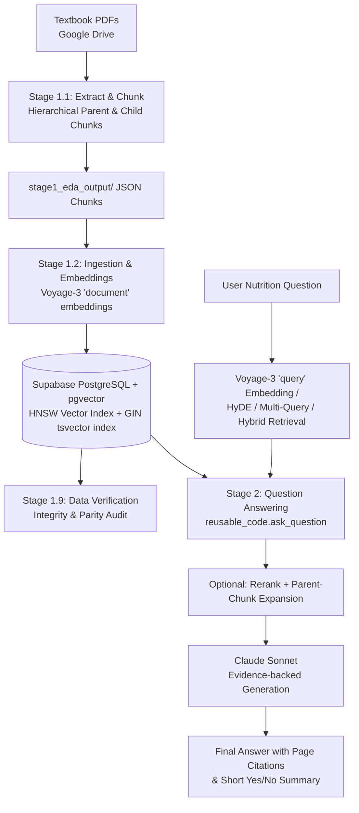

# RAG11 Nutrition — Evidence-Based Clinical Nutrition RAG Pipeline

A production-grade, hierarchical Retrieval-Augmented Generation (RAG) system built on foundational medical and clinical nutrition textbooks.

The pipeline uses **hierarchical parent-child chunking**, **Voyage AI domain-specific asymmetric embeddings**, **Supabase pgvector with HNSW indexing**, and **Claude Sonnet** to deliver grounded answers accompanied by verifiable textbook page citations. Retrieval quality is built up from five composable techniques — **reranking**, **hybrid (vector + keyword) search**, **parent-chunk expansion**, **HyDE**, and **multi-query question splitting** — implemented once in [`reusable_code/`](reusable_code/) and demonstrated one at a time in the `stage2_ask_examples*` notebooks.

---

## Architecture Overview



## Step 1: Environment & Dependencies Setup

### 1.1 Clone & Enter Workspace
```bash
git clone https://github.com/fotomain/RAG11-nutriciology.git
cd RAG11-nutriciology
```

### 1.2 Create & Activate Python Virtual Environment
Python 3.10+ is recommended:
```bash
python3 -m venv .venv
source .venv/bin/activate
```

### 1.3 Install Python Dependencies
```bash
pip install --upgrade pip
pip install -r requirements.txt
```

### 1.4 (Optional) System OCR Engine
*Required only if processing `source10` (scanned book without text layer)*:
- **macOS**: `brew install tesseract`
- **Linux (Debian/Ubuntu)**: `sudo apt-get install -y tesseract-ocr`

---

## Step 2: Prepare API Keys & Secrets (`.env`)

Create your `.env` file from the provided template:
```bash
cp .env.sample .env
```

Open `.env` and fill in the required credentials obtained from the official dashboards below:

| Variable | Description | Where to Get Key (URL) |
| :--- | :--- | :--- |
| **`PUBLIC_SUPABASE_URL`** | Supabase project endpoint | [Supabase Project Settings > API](https://supabase.com/dashboard/project/_/settings/api-keys) |
| **`PUBLIC_SUPABASE_ANON_KEY`** | Supabase client anon public key | [Supabase Project Settings > API](https://supabase.com/dashboard/project/_/settings/api-keys) |
| **`SUPABASE_SERVICE_ROLE_KEY`** | Supabase backend secret key (bypasses RLS for ingestion) | [Supabase Project Settings > API](https://supabase.com/dashboard/project/_/settings/api-keys) |
| **`VOYAGE_API_KEY`** | Voyage AI API key (`voyage-3` embeddings) | [Voyage AI Dashboard > API Keys](https://dash.voyageai.com/api-keys) |
| **`ANTHROPIC_API_KEY`** | Anthropic Claude API key (answer generation) | [Anthropic Console > API Keys](https://console.anthropic.com/settings/keys) |
| **`GOOGLE_AI_KEY`** | Google Gemini API key (optional / deep fetching) | [Google AI Studio > Get API Key](https://aistudio.google.com/app/apikey) |

> [!IMPORTANT]
> Never commit your `.env` file to version control. It is protected and excluded by `.gitignore`.

---

## Step 3: Initialize Database in Supabase

1. Open your Supabase project dashboard: [https://supabase.com/dashboard](https://supabase.com/dashboard).
2. Navigate to the **SQL Editor** from the left navigation panel (`https://supabase.com/dashboard/project/<YOUR_PROJECT_ID>/sql`).
3. Click **New query** and paste the complete content of:
   - [`sql/create_sql_tables.sql`](sql/create_sql_tables.sql)
4. Click **Run**. This script sets up:
   - `CREATE EXTENSION IF NOT EXISTS vector;`
   - `rag11_data_sources` table
   - `rag11_chunks_parent_table` table
   - `rag11_chunks_child_table` table with 1024-dimension `embedding vector(1024)`
   - Cosine distance HNSW vector index (`idx_rag11_child_hnsw`)
   - Vector search RPC function: `match_rag11_child_chunks`
   - Generated `tsvector` column + GIN index (`idx_rag11_child_chunk_tsv_gin`) and the `match_rag11_child_chunks_keyword` RPC, used by hybrid search

Every statement in this script is `create ... if not exists` / `create or replace function`, so it's also safe to re-run later against a database that already has ingested data (e.g. after pulling an update that adds the hybrid-search columns).

---

## Step 4: Step-by-Step Pipeline Execution

Execute the notebooks in sequence to run the entire RAG lifecycle:

```
stage1_0 (optional)  ──▶  stage1_1  ──▶  stage1_2  ──▶  stage1_9  ──▶  stage2
(Fetch sources)         (Chunk)         (Ingest)        (Verify)       (Ask & Eval)
```

### Stage 1.0 (Optional): Fetch Source Books
- **Notebook**: [`stage1_0_eda_fetch_best_sources.ipynb`](stage1_0_eda_fetch_best_sources.ipynb) or [`stage1_0_deep_fetch.ipynb`](stage1_0_deep_fetch.ipynb)
- **Action**: Downloads or catalogs high-quality clinical and medical nutrition textbooks.
- **Source Drive**: If already hosting PDFs in Google Drive, they are accessed from:
  `GOOGLE_DRIVE_SOURCES_FOLDER`: [Google Drive Nutrition Textbooks Folder](https://drive.google.com/drive/folders/1GwS2oNWkn_aLE1eDTbkHW73Ljun_aM4I?usp=drive_link)

### Stage 1.1: Extract Text & Hierarchical Chunking
- **Notebook**: [`stage1_1_extract_and_chunk.ipynb`](stage1_1_extract_and_chunk.ipynb)
- **Action**:
  - Pulls source PDFs directly from the Google Drive source folder or local directory.
  - Extracts text, headings, and tables (using `pymupdf` and `pdfplumber`).
  - Produces hierarchical chunks:
    - **Parent chunks**: Larger semantic context chunks.
    - **Child chunks**: Target retrieval chunks sized with `tiktoken` (`cl100k_base`).
  - Writes structured metadata manifests to `./stage1_eda_output/`.
  - **New PDFs need no code**: a file without its own `stage1_1_eda_packages/sourceN_<slug>.py` module is chunked by `generic_fallback.py` (PDF outline, else larger-font headings, else 10-page windows). Add a dedicated module later for better boundaries; it takes precedence automatically.

### Stage 1.2: Embeddings & Supabase Ingestion
- **Notebook**: [`stage1_2_eda_load_chunks.ipynb`](stage1_2_eda_load_chunks.ipynb)
- **Action**:
  - Loads chunk JSON files from `./stage1_eda_output/`.
  - Embeds all child chunk texts using Voyage AI (`voyage-3` with `input_type="document"`).
  - Batch upserts source rows, parent chunk rows, and child chunk rows with vectors into Supabase.

### Stage 1.9: Data Verification & Integrity Audit
- **Notebook**: [`stage1_9_eda_verify_all_data.ipynb`](stage1_9_eda_verify_all_data.ipynb)
- **Action**:
  - Runs automated consistency checks between local JSON files and Supabase tables.
  - Verifies zero missing rows, zero orphaned rows, and that every child chunk has a valid 1024-dim embedding.

### Stage 2: Question Answering & Evaluation
All Stage 2 notebooks import the shared [`reusable_code`](reusable_code/) package (`init_clients`, `ask_question`, ...) instead of redefining retrieval/generation logic per notebook. Each notebook embeds sample clinical nutrition questions, retrieves context from Supabase, synthesizes an answer with Claude strictly from that context, and formats a concise `Short answer: Yes/No`, an in-depth explanation, and verifiable textbook page citations.

| Notebook | Technique demonstrated |
| --- | --- |
| [`stage2_ask_examples1.ipynb`](stage2_ask_examples1.ipynb) | Baseline: plain vector search via `match_rag11_child_chunks` |
| [`stage2_ask_examples2_rerank.ipynb`](stage2_ask_examples2_rerank.ipynb) | Cross-encoder reranking (`use_rerank=True`) |
| [`stage2_ask_examples3_hybrid_search.ipynb`](stage2_ask_examples3_hybrid_search.ipynb) | Hybrid vector + keyword search fused with Reciprocal Rank Fusion (`use_hybrid=True`) |
| [`stage2_ask_examples4_parent_chunk_expansion.ipynb`](stage2_ask_examples4_parent_chunk_expansion.ipynb) | Small-to-big context expansion from child to parent chunk (`expand_to_parents=True`) |
| [`stage2_ask_examples5_hypothetical_document_embedding.ipynb`](stage2_ask_examples5_hypothetical_document_embedding.ipynb) | HyDE — embed a Claude-drafted hypothetical answer instead of the bare question (`use_hyde=True`) |
| [`stage2_ask_examples6_multi_query_question_splitting.ipynb`](stage2_ask_examples6_multi_query_question_splitting.ipynb) | Multi-query / question splitting for compound questions (`use_multi_query=True`) |

`ask_question()` composes all of these techniques by default (see [`reusable_code/README.md`](reusable_code/README.md#feature-flags-configpy-env) for how `.env`'s `USE_*` flags and per-call keywords interact), so `stage2_ask_examples1.ipynb` is the only notebook that isolates the plain baseline; the others each force one technique on to show its effect in isolation.

For the mechanics and rationale behind each technique, see the write-ups in [`documentation/`](documentation/):
- [`HOW_IT_WORKS_Hybrid_Search.html`](documentation/HOW_IT_WORKS_Hybrid_Search.html)
- [`HOW_IT_WORKS_Hypothetical_Document_Embedding.html`](documentation/HOW_IT_WORKS_Hypothetical_Document_Embedding.html)
- [`HOW_IT_WORKS_Multi_Query_Question_Splitting.html`](documentation/HOW_IT_WORKS_Multi_Query_Question_Splitting.html)
- [`HOW_IT_WORKS_Parent_Chunk_Expansion.html`](documentation/HOW_IT_WORKS_Parent_Chunk_Expansion.html)
- [`RAG11_HOW_IT_WORKS_DATA_FLOW_v5.html`](documentation/RAG11_HOW_IT_WORKS_DATA_FLOW_v5.html) — end-to-end data flow
- [`RAG11_HOW_TO_RUN_FROM_SCRATCH.html`](documentation/RAG11_HOW_TO_RUN_FROM_SCRATCH.html) — full from-scratch run guide

---

## `reusable_code/` — the shared retrieval & generation package

Every Stage 2 notebook imports from [`reusable_code/`](reusable_code/) rather than redefining `require_env`, `ask_question`, retrieval, or reranking logic per notebook:

```python
from reusable_code import init_clients, ask_question

clients = init_clients()  # reads .env once; cached for the rest of the kernel
result = ask_question("Is vitamin C a water-soluble vitamin?")
```

It covers client setup (`clients.py`), retrieval (`retrieval.py`, `hybrid_search.py`, `hypothetical_document_embedding.py`, `multi_query_question_splitting.py`, `parent_chunk_expansion.py`), reranking and manual overrides (`rerunk_code.py`), generation (`generation.py`), and row-level CRUD helpers for the parent/child chunk tables (`crud_chunks_parent.py`, `crud_chunks_child.py`). See [`reusable_code/README.md`](reusable_code/README.md) for the full module map and how each retrieval technique composes with the others.

### Running the test suite
[`test_reusable_code.py`](test_reusable_code.py) exercises `reusable_code` against fully faked Supabase/Voyage/Anthropic clients — no network access or `.env` required:
```bash
python3 test_reusable_code.py
```

---

## Step 5: Save & Synchronize Workspace to GitHub

A hardened synchronization utility is included to ensure your notebooks, code, and evaluation results are safely committed and pushed without getting blocked by Git locks or remote divergence:

### Option A: From Terminal or Finder
Run the script directly from the project root:
```bash
./save_to_github.command
```
*(Or pass a custom commit message: `./save_to_github.command "Finished stage 2 evaluations"`)*

### Option B: Directly Inside the Notebook
Run **Cell #14** in [`stage2_ask_examples1.ipynb`](stage2_ask_examples1.ipynb):
```python
save_to_github("stage2_ask_examples1.ipynb - answers verified and synced")
```

**Features built into the sync tool:**
- Automatically terminates hung background `git` processes.
- Clears stale `.git/index.lock` files if an earlier process crashed.
- Synchronizes remote changes (safe auto-stash, rebase, or merge) to avoid non-fast-forward push rejections.
- Push retry with backoff.

---

## Database Maintenance & SQL Utilities

- **[`sql/create_sql_tables.sql`](sql/create_sql_tables.sql)**: Complete database schema creation and RPC setup.
- **[`sql/delete_chunks_data.sql`](sql/delete_chunks_data.sql)**: Safely truncate/delete chunks and source records if you need to re-run Stage 1.2 from scratch.
- **[`sql/drop_all_tables.sql`](sql/drop_all_tables.sql)**: Complete teardown of all RAG11 database objects.
